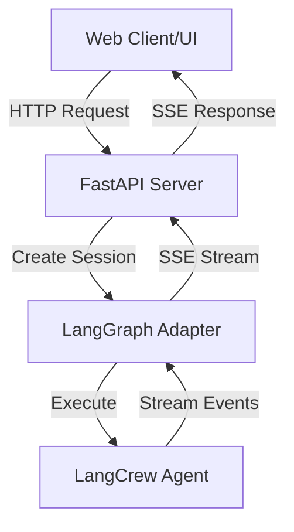

Web provides HTTP server capabilities for exposing AI agents as web services with real-time streaming communication, built on FastAPI and integrated with LangGraph's execution engine.

## Quick Start - Just 3 Lines

Get your agent running as a web service in just 3 lines:

```python
from langcrew import Agent, Crew
from langcrew.web import create_server

agent = Agent(role="Assistant", goal="Help users", backstory="Helpful AI")
server = create_server(Crew(agents=[agent]))
server.run(port=8000)  # Visit http://localhost:8000/docs
```

:::tip[Complete Guide]
For detailed setup, configuration options, and examples, see the [Getting Started](/guides/web/getting-started) guide.
:::

## What is Web?

Web in langcrew provides:

- **HTTP Server**: FastAPI-based server for agent communication
- **Streaming Communication**: Real-time agent responses via SSE (Server-Sent Events)
- **LangGraph Integration**: Direct integration with LangGraph's streaming capabilities
- **Protocol Communication**: Structured message protocols for frontend integration
- **Production Ready**: Built-in CORS, error handling, and health checks
- **Built-in Web UI**: Ready-to-use React-based interface for agent interaction

## Core Architecture

Web is built around a minimal HTTP server that bridges AI agents with web clients:



### Key Components

- **AdapterServer**: FastAPI-based HTTP server handling client requests
- **LangGraphAdapter**: Streaming adapter bridging agents with LangGraph execution
- **Communication Protocol**: Structured message formats for consistent frontend integration
- **Web UI Components**: React-based interface components for agent visualization

## Built-in Web UI

LangCrew includes a comprehensive React-based web interface:

### UI Features

- **Real-time Chat Interface**: Stream agent responses with typing indicators
- **Tool Call Visualization**: See agent tool usage and results in real-time
- **Plan Execution Tracking**: Visualize multi-step agent planning and execution
- **File Upload Support**: Upload and process documents through the interface
- **Session Management**: Maintain conversation history across sessions
- **HITL Integration**: Human-in-the-loop approval interfaces
- **Modern Design**: Built with Antd + Tailwind CSS for professional appearance

### UI Architecture

- **Framework**: React 19 with TypeScript
- **State Management**: Zustand for efficient state handling
- **Build System**: Rspack for fast development and builds
- **Styling**: Tailwind CSS with Antd component library
- **Package Management**: pnpm for efficient dependency management

### Quick UI Setup

```bash
cd web/
pnpm install
pnpm dev  # Opens at http://localhost:3000/chat
```

## Communication Protocol

Web uses **SSE (Server-Sent Events)** for real-time streaming communication:

- **Transport**: HTTP with SSE streaming
- **Authentication**: None built-in (users can add custom middleware)
- **Message Format**: JSON with structured types (text, tool_call, plan, etc.)
- **Session Management**: Automatic session handling with unique IDs

For complete protocol specifications and message formats, see the [Communication Protocol](/guides/web/protocol) documentation.

## Usage Patterns

### Two Integration Approaches

**1. LangCrew Integration**

```python
from langcrew import Agent, Crew
from langcrew.web import create_server

crew = Crew(agents=[agent])
server = create_server(crew=crew)
```

**2. LangGraph Integration**  

```python
from langcrew.web import create_langgraph_server
from langgraph.graph import StateGraph

compiled_graph = workflow.compile()
server = create_langgraph_server(graph=compiled_graph)
```

### Message Flow

1. **Client Request** → HTTP POST to `/api/v1/chat`
2. **Session Init** → Server creates session and returns session_id
3. **Agent Processing** → LangGraph executes agent workflow
4. **Streaming Response** → Server streams events via SSE:
   - Plan messages (execution steps)
   - Tool call messages (tool execution)
   - Text messages (agent responses)
   - Status messages (progress updates)
5. **Session End** → Finish reason message completes the flow

## When to Use Web

- **Interactive AI Applications** requiring real-time user interaction
- **Agent-based Web Services** needing HTTP API endpoints
- **Streaming Applications** with real-time response requirements
- **Multi-session Applications** with conversation continuity
- **Tool-rich Agents** requiring visual tool call feedback
- **HITL Workflows** needing human approval interfaces
- **Rapid Prototyping** with ready-to-use UI components

## Next Steps

Ready to start building? Explore the [Guides](/guides/quickstart) section for practical implementation examples and tutorials.
