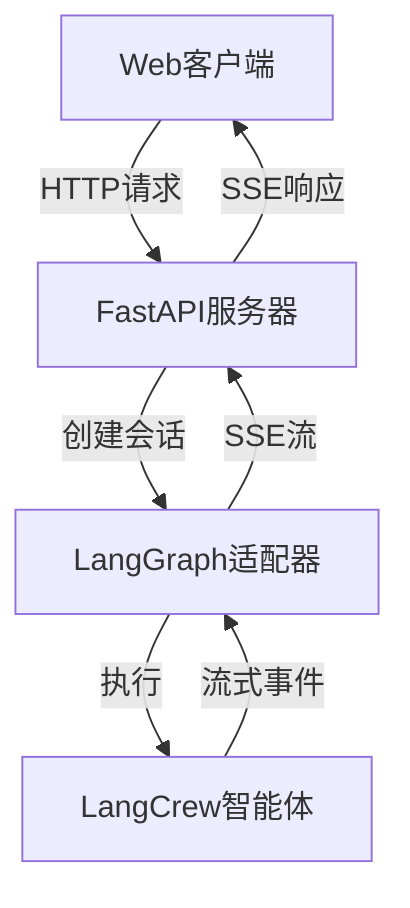

Web服务为AI智能体提供HTTP服务器功能，支持实时流式通信，基于FastAPI构建并与LangGraph执行引擎集成，将智能体暴露为Web服务。

## 快速开始 - 只需3行代码！

只需3行代码即可让您的智能体作为Web服务运行：

```python
from langcrew import Agent, Crew
from langcrew.web import create_server

agent = Agent(role="助手", goal="帮助用户", backstory="有用的AI")
server = create_server(Crew(agents=[agent]))
server.run(port=8000)  # 访问 http://localhost:8000/docs
```

:::tip[完整指南]
详细设置、配置选项和示例，请参阅[快速开始](/zh/guides/web/getting-started)指南。
:::

## 什么是Web服务？

langcrew中的Web服务提供：
- **HTTP服务器**：基于FastAPI的智能体通信服务器
- **流式通信**：通过SSE（Server-Sent Events）实现实时智能体响应
- **LangGraph集成**：与LangGraph流式功能直接集成
- **协议通信**：用于前端集成的结构化消息协议
- **生产就绪**：内置CORS、错误处理和健康检查

## 核心架构

Web服务围绕最小化HTTP服务器构建，在AI智能体和Web客户端之间建立桥梁：



### 核心组件

- **AdapterServer**：基于FastAPI的HTTP服务器，处理客户端请求
- **LangGraphAdapter**：流式适配器，在智能体和LangGraph执行之间建立桥梁
- **通信协议**：用于一致前端集成的结构化消息格式

## 通信协议

Web使用**SSE（Server-Sent Events）**进行实时流式通信：

- **传输方式**：带SSE流的HTTP
- **身份验证**：无内置验证（用户可添加自定义中间件）
- **消息格式**：带结构化类型的JSON（text、tool_call、plan等）
- **会话管理**：使用唯一ID自动处理会话

有关完整的协议规范和消息格式，请参阅[通信协议](/zh/guides/web/protocol)文档。

## 使用模式

### 两种集成方式

**1. LangCrew集成**
```python
from langcrew import Agent, Crew
from langcrew.web import create_server

crew = Crew(agents=[agent])
server = create_server(crew=crew)
```

**2. LangGraph集成**  
```python
from langcrew.web import create_langgraph_server
from langgraph.graph import StateGraph

compiled_graph = workflow.compile()
server = create_langgraph_server(graph=compiled_graph)
```

### 消息流程

1. **客户端请求** → HTTP POST到 `/api/v1/chat`
2. **会话初始化** → 服务器创建会话并返回session_id
3. **智能体处理** → LangGraph执行智能体工作流
4. **流式响应** → 服务器通过SSE流式传输事件：
   - 计划消息（执行步骤）
   - 工具调用消息（工具执行）
   - 文本消息（智能体响应）
   - 状态消息（进度更新）
5. **会话结束** → 完成原因消息结束流程

## 何时使用Web服务

- **交互式AI应用程序** 需要实时用户交互
- **基于智能体的Web服务** 需要HTTP API端点
- **流式应用程序** 有实时响应需求
- **多会话应用程序** 需要对话连续性
- **工具丰富的智能体** 需要可视化工具调用反馈
- **HITL工作流** 需要人工审批界面

## 下一步

- **[快速开始](/zh/guides/web/getting-started)** - 快速设置和基础示例
- **[HTTP服务器](/zh/guides/web/http-server)** - 高级配置和生产部署
- **[通信协议](/zh/guides/web/protocol)** - 完整消息规范