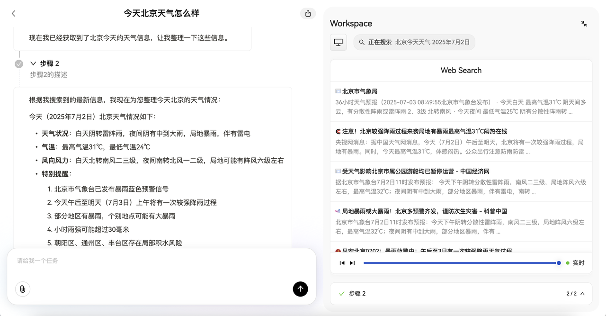

# LangCrew UI · High-Performance & Extensible Frontend Component Library

**LangCrew UI** is a high-performance UI component library built with a modern frontend tech stack.
It comes with core components like **AgentX**, enabling developers to quickly build production-grade applications across various business scenarios.

---

## 📖 Table of Contents

- [Features](#-features)
- [Tech Stack](#-tech-stack)
- [Getting Started](#-getting-started)
  - [Local Development](#local-development)
  - [Local Installation of LangCrew UI](#local-installation-of-langcrew-ui)
- [Usage Example](#-usage-example)
- [API Reference](#-api-reference)
- [Value Proposition](#-value-proposition)
- [Authors](#-authors)
- [License](#-license)

---

## 🚀 Features

- ⚡ **Quick Integration** — Zero-config, plug-and-play setup
- 🧩 **Highly Extensible** — Deep customization for various business needs
- 🎨 **Modern Design** — Blends Antd with Tailwind CSS for beauty & usability
- 🛠 **Developer-Friendly** — Clear API definitions and well-structured docs
- 📦 **Fast Build** — Powered by Rspack + Pnpm for a smooth dev experience

---

## 🛠 Tech Stack

| Module       | Technology    |
| ------------ | ------------- |
| Framework    | React 19      |
| UI Library   | Antd + Antd X |
| State Mgmt   | Zustand       |
| Build Tool   | Rspack        |
| Styling      | Tailwind CSS  |
| Package Mgmt | Pnpm          |

---

## ⚡ Getting Started

### Local Development

```bash
pnpm install
pnpm dev

# Open Browser
http://localhost:3000/chat
```

---

### Local Installation of LangCrew UI

```bash
# In the web root directory
pnpm install    # Install dependencies
pnpm run publish     # Generate ./agentx directory

# Copy to your target project
cp -r agentx /your-project

# Install locally
pnpm add ./agentx
```

---

## 💻 Usage Example

```jsx
import AgentX from 'agentx';

<AgentX
  agentId="your-agent-id"
  sessionId=""
  shareId=""
  sharePassword=""
  basePath=""
  backPath=""
  headerNode={<></>}
  footerNode={<></>}
  shareButtonNode={<></>}
  knowledgeBases={[]}
  mcpTools={[]}
  sandboxTools={[]}
  selectedKnowledgeBases={[]}
  selectedTools={[]}
  requestPrefix=""
  extraHeaders={{}}
  language=""
  senderContent=""
/>;
```

> ⚠ **Note:**`agentId` is **required** and must be obtained from the **LangCrew Admin Panel**.

---

## 📚 API Reference

| Prop Name              | Type          | Description                  | Required |
| ---------------------- | ------------- | ---------------------------- | -------- |
| agentId                | `string`      | Agent ID                     | ✅       |
| sessionId              | `string`      | Session ID                   | ❌       |
| shareId                | `string`      | Share ID                     | ❌       |
| sharePassword          | `string`      | Share password               | ❌       |
| basePath               | `string`(URL) | Route prefix                 | ❌       |
| backPath               | `string`(URL) | Return path                  | ❌       |
| headerNode             | `ReactNode`   | Custom header                | ❌       |
| footerNode             | `ReactNode`   | Custom footer                | ❌       |
| shareButtonNode        | `ReactNode`   | Custom share button          | ❌       |
| knowledgeBases         | `Array`       | Knowledge base list          | ❌       |
| mcpTools               | `Array`       | MCP tool list                | ❌       |
| sandboxTools           | `Array`       | Sandbox tool list            | ❌       |
| selectedKnowledgeBases | `Array`       | Pre-selected knowledge bases | ❌       |
| selectedTools          | `Array`       | Pre-selected tool IDs        | ❌       |
| requestPrefix          | `string`      | Request prefix               | ❌       |
| extraHeaders           | `Record`      | Additional HTTP headers      | ❌       |
| language               | `string`      | Language code                | ❌       |
| senderContent          | `string`      | Content to be sent           | ❌       |

---

## 🌟 Value Proposition

- ✅ **Rapid Deployment** — Core components ready out-of-the-box
- ✅ **UI Consistency** — Unified visual & interaction standards
- ✅ **High Flexibility** — Custom rendering & event handling
- ✅ **Outstanding Performance** — Optimized for build & runtime

---

## 👥 Authors

- Wang Zihao
- Sheng Qing
- Liu Shaoming
- Chang Chunxing

---

## 📄 License

This project is licensed under the [MIT License](https://chatgpt.com/c/LICENSE).

---

## 📷 Screenshots


