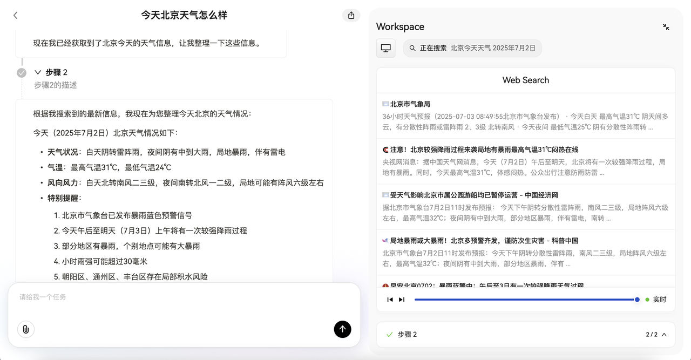

# AgentX

AgentX is a React component library for building AI agent interfaces. It provides a complete chat experience, streaming responses, tool-call visualization, file previews, knowledge-base selection, and extensible widgets.



## Features

- Page, embedded, and preview display modes
- SSE streaming with message history and reconnection support
- Built-in renderers for text, reasoning, plans, tool calls, browser actions, code execution, and file operations
- Extensible message-type and widget registries
- File upload, attachment management, and previews for images, Office files, PDF, source code, text, and video
- Knowledge-base and tool selection
- Client-side tools and actions
- English, Chinese, Russian, and Kazakh localization
- React 19, TypeScript, Ant Design, Zustand, Rspack, and Tailwind CSS

## Installation

```bash
npm install langcrew-agentx
```

```bash
pnpm add langcrew-agentx
```

```bash
yarn add langcrew-agentx
```

## Quick Start

```tsx
import AgentX from 'langcrew-agentx';

export function App() {
  return <AgentX agentId="your-agent-id" displayMode="page" />;
}
```

### Page Mode

Page mode provides a complete agent page. After creating a session, it navigates to `${basePath}/${agentId}/${sessionId}`.

```tsx
import AgentX from 'langcrew-agentx';

export function ChatPage() {
  return (
    <AgentX
      agentId="your-agent-id"
      displayMode="page"
      sessionId="session-id"
      basePath="/chat"
      requestPrefix="/api"
      language="en"
    />
  );
}
```

### Embedded Mode

Embedded mode keeps session state in the component and does not navigate after creating a session.

```tsx
import AgentX from 'langcrew-agentx';

export function EmbeddedChat() {
  return (
    <div style={{ height: 600 }}>
      <AgentX
        agentId="your-agent-id"
        displayMode="embedded"
        welcomeScreen={({ send, disabled }) => (
          <button disabled={disabled} onClick={() => send('What can AgentX do?')}>
            Start a conversation
          </button>
        )}
      />
    </div>
  );
}
```

### Preview Mode

Preview mode keeps the user on the current page and displays tool details or file previews in a Workspace panel on the right.

```tsx
import AgentX from 'langcrew-agentx';

export function PreviewChat() {
  return (
    <AgentX
      agentId="your-agent-id"
      displayMode="preview"
      layoutConfig={{
        showWorkspace: true,
        showHomePage: false,
        headerPosition: 'inner',
      }}
      sessionConfig={{
        enableRouting: false,
        enableSessionLoading: false,
      }}
    />
  );
}
```

## Core Concepts

### Display Modes

| Mode | Navigation | Workspace | Typical use |
| --- | --- | --- | --- |
| `page` | Navigates after session creation | Enabled | Full agent applications |
| `embedded` | Stays on the current page | Disabled by default | Embedded assistants |
| `preview` | Stays on the current page | Enabled | Agent builders and preview surfaces |

`displayMode` remains available as a compatibility preset. New integrations can configure layout and session behavior directly with `layoutConfig`, `sessionConfig`, and `senderConfig`.

### Message Types

AgentX uses a message-type registry with brief and detail renderers. Matchers can be strings, arrays, or regular expressions.

Built-in message types include:

- `text`, `reasoning`, `live_status`, `plan`, and `error`
- `web_search`, `run_command`, `code_interpreter`, and `mysql`
- `file_parser`, `image_parser`, `image_generation`, and `file_diff`
- `browser_*`, `phone`, `service_deploy`, and `user_input`
- `markdown_result`, `milvus_qa_search`, `claude_skill`, and `widget`

See [the registry documentation](./src/registry/README.md) for extension APIs and renderer examples.

### Widgets

The widget engine converts structured JSON into React components:

```json
{
  "type": "Card",
  "children": [
    {
      "type": "Text",
      "value": "Hello, AgentX",
      "weight": "semibold",
      "size": "lg"
    },
    {
      "type": "Button",
      "text": "Continue",
      "variant": "primary"
    }
  ]
}
```

Built-in widgets include layout, typography, form, media, chart, and Markdown components. See [the engine documentation](./src/engines/README.md) for the supported schema.

### Client Tools and Actions

Client tools run application-specific behavior in the browser:

```tsx
import { registerClientTool } from 'langcrew-agentx';

registerClientTool('copy_to_clipboard', async (params) => {
  await navigator.clipboard.writeText(params.text);
  return { success: true };
});
```

Client actions can expose UI behavior such as file downloads:

```tsx
import { registerClientAction } from 'langcrew-agentx';

registerClientAction('download_file', async (params) => {
  const link = document.createElement('a');
  link.href = params.url;
  link.download = params.filename;
  link.click();
  return { success: true };
});
```

### File Previews

AgentX previews common image, Office, PDF, source-code, text, and video formats. It provides syntax highlighting, Office document rendering, Markdown and HTML preview modes, file diffs, image navigation, and video controls.

Use `filePreviewConfig` to provide a custom Office preview URL or replace the built-in preview behavior:

```tsx
<AgentX
  agentId="your-agent-id"
  filePreviewConfig={{
    office: {
      getPreviewUrl: (fileUrl) => `/office-preview?url=${encodeURIComponent(fileUrl)}`,
    },
    onPreview: (context) => {
      console.log('Preview requested for', context.file);
      context.defaultPreview();
    },
  }}
/>
```

## API Overview

The source types in [`src/types/agentx.ts`](./src/types/agentx.ts) are the authoritative API reference.

| Prop | Type | Description |
| --- | --- | --- |
| `agentId` | `string` | Required agent identifier |
| `sessionId` | `string` | Existing session to load |
| `chatEndpoint` | `string` | Direct endpoint that bypasses session creation |
| `displayMode` | `'page' \| 'embedded' \| 'preview'` | Compatibility display preset |
| `layoutConfig` | `AgentLayoutConfig` | Workspace, Home page, narrow layout, and Header configuration |
| `sessionConfig` | `AgentSessionConfig` | Routing, session loading, and archive retry behavior |
| `senderConfig` | `AgentSenderConfig` | Input layout, disabled states, and slash-command shortcuts |
| `knowledgeBases` | `KnowledgeBaseItem[]` | Available knowledge bases |
| `mcpTools` | `MCPToolItem[]` | Available MCP tools |
| `models` | `ModelItem[]` | Available models |
| `selectedKnowledgeBases` | `string[]` | Initially selected knowledge bases |
| `selectedTools` | `string[]` | Initially selected tools |
| `selectedModels` | `string[]` | Initially selected models |
| `requestPrefix` | `string` | API request path prefix |
| `extraHeaders` | `Record<string, string>` | Headers attached to AgentX API requests |
| `language` | `string` | Interface language |
| `welcomeScreen` | `ReactNode \| (context) => ReactNode` | Custom empty-conversation screen |
| `filePreviewConfig` | `FilePreviewConfig` | Built-in or custom file-preview behavior |
| `clientToolHandlers` | `ClientToolHandlers` | Instance-scoped client-tool handlers |
| `onToolResult` | `(context) => void \| Promise<void>` | Tool-result notification |
| `onSessionLoaded` | `(sessionInfo, chunks) => void \| Promise<void>` | Session-history notification |

Common exports include:

```tsx
import AgentX, {
  WidgetRender,
  messageTypeRegistry,
  registerClientTool,
  executeClientTool,
  registerClientAction,
  executeClientAction,
} from 'langcrew-agentx';

import type {
  KnowledgeBaseItem,
  MCPToolItem,
  FileItem,
  MessageChunk,
  SessionInfo,
  MessageItem,
  ModelItem,
} from 'langcrew-agentx';
```

## Local Development

From the `web` directory:

```bash
pnpm install
pnpm dev
```

Build the application or library bundle:

```bash
pnpm build
pnpm build:lib
```

Run the test suite:

```bash
pnpm test
pnpm test:coverage
pnpm test:ui
```

The library build is written to `web/agentx`.

## Publishing

```bash
pnpm build:lib
cd agentx
npm publish
```

## Contributing

1. Create a focused feature branch.
2. Add or update tests for behavioral changes.
3. Run the test suite and build locally.
4. Use an English [Conventional Commit](https://www.conventionalcommits.org/) subject.
5. Open a pull request describing the behavior and verification.

## License

This project is distributed under the [MIT License](./LICENSE).
